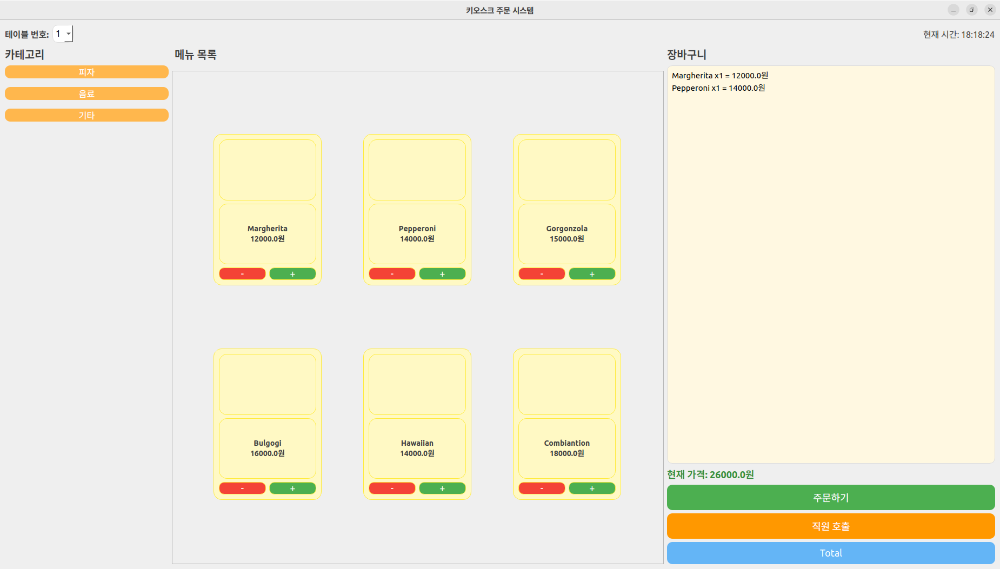
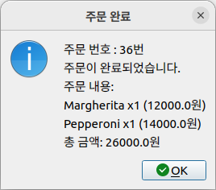
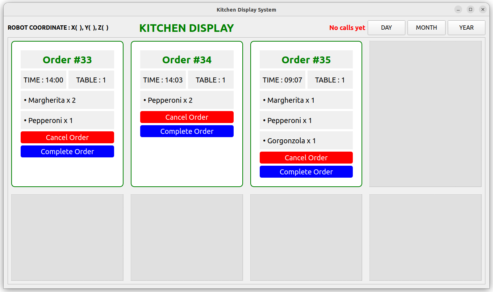
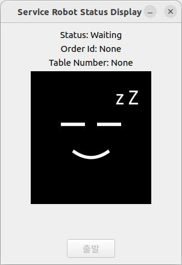
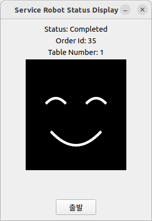
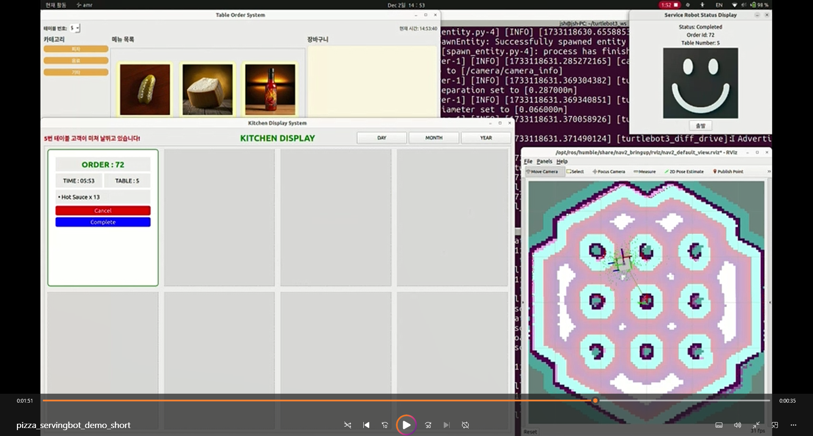

# PizzaServingBot
C++ version of pizza_serving_bot project

## Description
When a customer orders at a pizza place, the kitchen monitor displays the order number, table number, and order details. When the employee confirms, the table number is sent to the AMR bot. The AMR bot is in the Waiting state before receiving an order, and when the employee touches the Start button on the AMR bot's display, it starts driving to the predefined table coordinates. Once driving begins, the status changes to Moving, and after delivery is complete, it changes to Completed. Each time the status changes, it is displayed on the AMR bot's display.

## Capture
<p align="center">
  
  
</p>

<p align="center">
  
</p>

<p align="center">
  
  
</p>

<p align="center">
  
</p>

## Demo Video

[pizza_servingbot_demo](capture/pizza_servingbot_demo_short.mp4)


## How to build

```console
cd ~/b3_ws
rm -rf ./install ./build ./log
colcon build 

source install/setup.bash
```
## The order of execution


### 1. Running the API server 
store order infomation and query DB

```console
python3 api_server.py

```

### 2. Running Kitchen Node

Save order information to DB (API server operation), send ROS2 service request to kiosk. When [Cancel], execute CancelService, when [Complete], send table target location to AMR bot as service (GoalLoc).

```console
ros2 run pizza_serving_bot kitchen 
```

### 3. Running Kiosk Node

Send a request to the ROS2 Order Service (OrderService) from the table, and publish a call to the employee topic (CallManager)

```console
ros2 run pizza_serving_bot kiosk 
```

### 4. Running Amr Node
AMR bot displays status value, navigation to the target table, and returns to the original location when you press confirm after arrival.

```console
ros2 run pizza_serving_bot amr 

```
